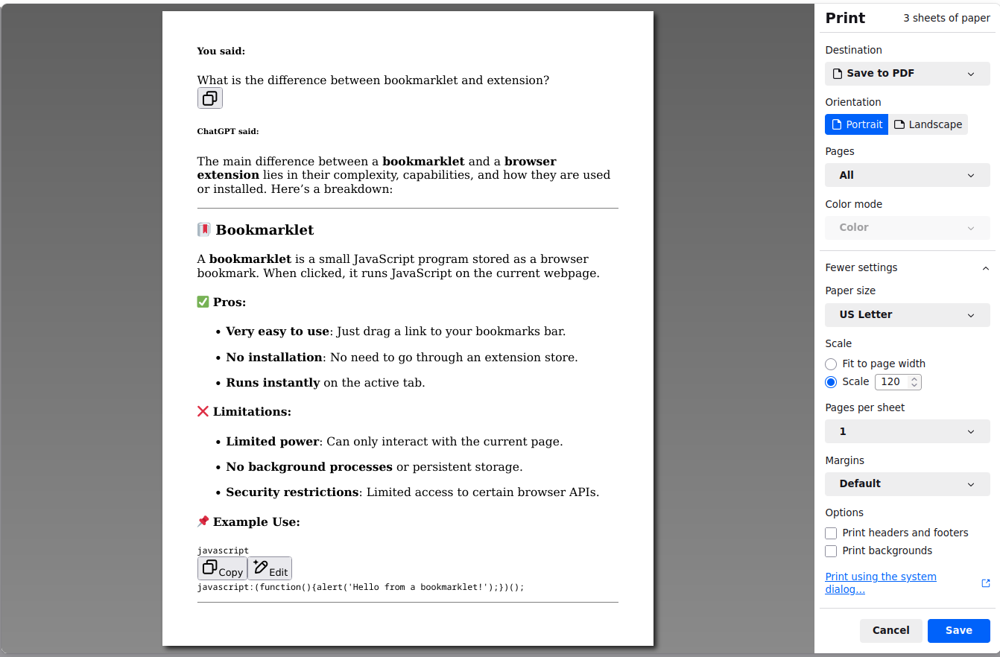

# 📄 ChatGPT to PDF — Bookmarklet

A simple JavaScript **bookmarklet** that triggers the browser's native print dialog (`window.print()`), allowing users to
**save ChatGPT conversation as a PDF** without installing extensions or third-party tools.

## 🔖 What Is a Bookmarklet?

A bookmarklet is a tiny JavaScript program stored as a browser bookmark. When clicked, it runs on the current page.

## 🚀 Features

- Uses built-in `window.print()` — no external libraries required
- One-click to print or save a page as a PDF
- Minimal, fast, and private — no data leaves your browser

## 📥 How to Install

1. **Create a new bookmark** in your browser.
2. **Paste the following JavaScript code** into the **URL** or **Location** field.
3. **Click on the Save button** to save it.

```js
javascript:(()=>{const articles=document.getElementsByTagName('article');const html=document.createElement('div');const wnd=window.open('about:blank', '', '_blank');for(const article of articles){html.innerHTML+=article.innerHTML;}wnd.document.write(html.innerHTML);wnd.print();})();
```

## Save to PDF


